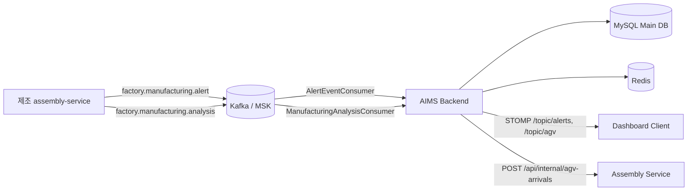
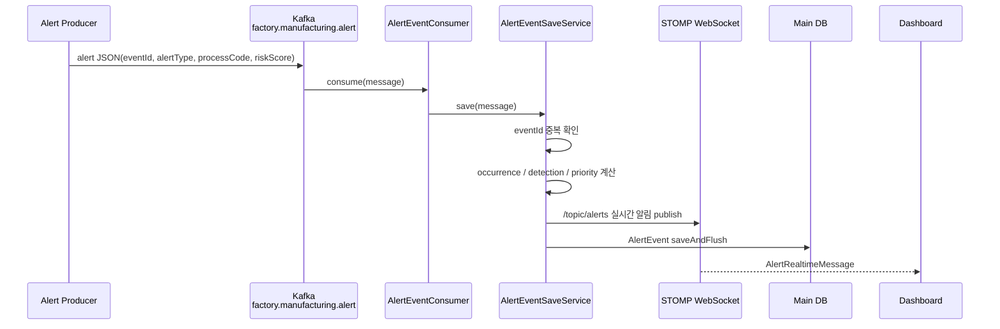
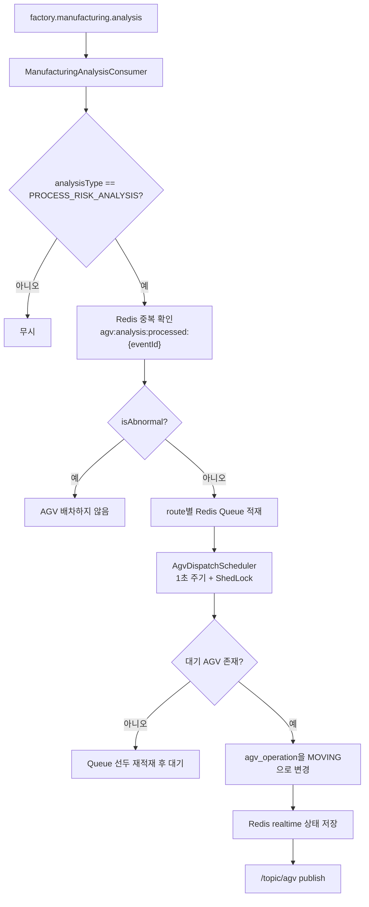
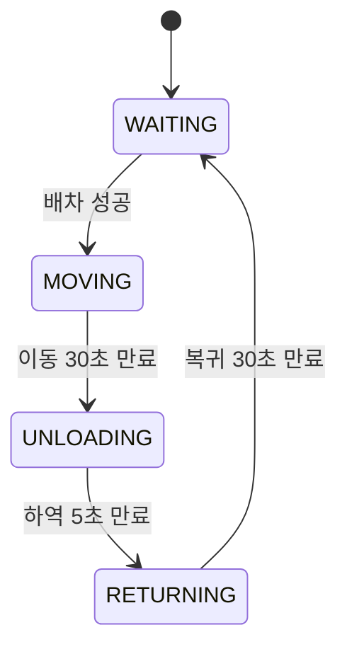
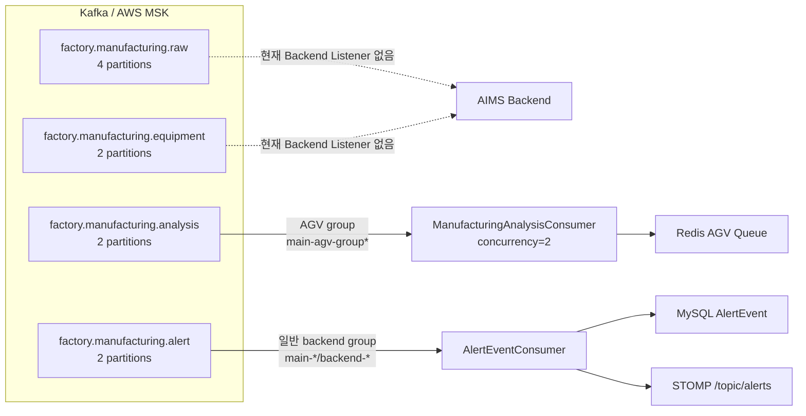

# AIMS - Backend
### AIMS (Auto Intelligence Manufacturing System) - AI 기반 자동차 스마트팩토리 관제 시스템

`backend`는 AIMS의 **Spring Boot 기반 Main Backend 서비스**입니다. 제조/분석 서비스가 Kafka로 전달한 알림 및 공정 분석 이벤트를 소비하고, 알림 이력·분석 결과·AGV 운영 상태를 운영 화면에서 조회할 수 있도록 API와 실시간 WebSocket 메시지를 제공합니다.

이 Backend가 담당하는 핵심 기능은 다음과 같습니다.

- Kafka의 `factory.manufacturing.alert` 이벤트를 검증·중복 제거·점수화하여 `AlertEvent`로 저장합니다.
- Kafka의 `factory.manufacturing.analysis` 이벤트 중 `PROCESS_RISK_ANALYSIS` 결과를 이용해 정상 공정의 AGV 배차를 요청합니다.
- 알림 조치 이력과 공정별 분석 결과를 바탕으로 유사 장애 조치 추천을 제공합니다. 이는 현재 코드상 별도 AI 모델 호출이 아니라 Main DB의 유사 분석 결과와 조치 타임라인을 조회하는 방식입니다.
- Redis에 AGV 대기열 및 실시간 운행 상태를 관리하고, `/topic/alerts`와 `/topic/agv`로 운영 화면에 변경 사항을 전달합니다.
- OpenSearch Client 연결 설정은 존재하지만, 이 저장소에서 OpenSearch로 분석 결과를 색인하거나 조회하는 서비스 로직은 확인되지 않습니다. 현재 주된 영속화는 Main DB와 Redis입니다.

## 핵심 구조



현재 Backend 코드에는 `KafkaTemplate` Producer Bean이 정의되어 있지만, 애플리케이션 서비스에서 Kafka로 메시지를 발행하는 호출은 확인되지 않습니다. 따라서 실제 입력 Producer는 외부 제조/분석 서비스로 보는 것이 맞습니다.

## 알림 처리
<table>
  <tr>
    <th align="center" width="50%">알림 우선순위 구조</th>
    <th align="center" width="50%">알림 목록</th>
  </tr>
  <tr>
    <td align="center" valign="middle">
      
    </td>
    <td align="center" valign="middle">
      
    </td>
  </tr>

  <tr>
    <th align="center" width="50%">알림 조치</th>
    <th align="center" width="50%">알림 상세</th>
  </tr>
  <tr>
    <td align="center" valign="middle">
      
    </td>
    <td align="center" valign="middle">
      
    </td>
  </tr>
</table>

알림은 `factory.manufacturing.alert` 토픽을 `AlertEventConsumer`가 소비합니다. `AlertEventSaveService`는 JSON을 정규화하고 중복 이벤트를 걸러낸 뒤 점수를 계산하여 DB에 저장합니다.

### 처리 순서



### 점수와 상태

- 지원 공정: `PRESS`, `BODY`, `PAINT`, `ASSEMBLY`
- 알림 유형: `PROCESS`, `EQUIPMENT`
- `riskScore`는 0~100 범위이며 필수입니다.
- `occurrenceScore`: 같은 `eventKey`의 최근 30일 발생 빈도 기반
- `detectionScore`: 과거 조치 상태(`COMPLETED`, `INCOMPLETE`, `NOT_NEEDED`) 기반
- `priorityScore`: `riskScore × (1 + occurrenceScore) × (1 + detectionScore)`
- `priorityScore >= 250`이면 `DANGER`, 그 미만이면 `CAUTION`
- 같은 `eventId`가 이미 저장되어 있으면 중복 처리하지 않습니다.

알림 실시간 메시지는 `/topic/alerts`로 발행되며, 알림 이력과 조치 정보는 Main DB의 `alert_event`, `action_timeline`을 통해 조회합니다. WebSocket publish가 실패하더라도 DB 저장 흐름 자체는 계속 진행하도록 처리되어 있습니다.

### 알림 API

| 기능 | HTTP API |
| --- | --- |
| 알림 목록/검색 | `GET /api/event` |
| 우선순위 요약 | `GET /api/event/priority-summary?days=7` |
| 알림 상세 | `GET /api/event/{logNo}` |
| eventId로 조회 | `GET /api/event/by-event-id/{eventId}` |
| 조치 상태 변경 | `PATCH /api/event/{logNo}/action` |
| 조치 타임라인 조회 | `GET /api/event/{logNo}/action-timeline` |
| 조치 타임라인 등록 | `POST /api/event/{logNo}/action-timeline` |
| 유사 장애 조치 추천 | `GET /api/event/{logNo}/recommendation` |

## AGV 배차 및 운반


AGV는 분석 결과를 직접 Kafka로 재발행하지 않고, 분석 이벤트를 소비한 뒤 Redis 대기열과 DB 상태를 조합하여 시뮬레이션합니다.

### 분석 이벤트 → 배차 흐름

`ManufacturingAnalysisConsumer`는 `factory.manufacturing.analysis`를 소비하고, `analysisType == PROCESS_RISK_ANALYSIS`인 이벤트만 처리합니다. 동일 `eventId`는 Redis의 `agv:analysis:processed:{eventId}` 키로 1분 동안 중복 방지합니다. 분석 결과가 abnormal이면 AGV를 배차하지 않습니다.



### Route와 Redis 자료구조

| 출발 공정 | 도착 공정 | routeCode | 배차 Queue 키 |
| --- | --- | --- | --- |
| `PRESS` | `BODY` | `PRESS_BODY` | `agv:dispatch:queue:PRESS_BODY` |
| `BODY` | `PAINT` | `BODY_PAINT` | `agv:dispatch:queue:BODY_PAINT` |
| `PAINT` | `ASSEMBLY` | `PAINT_ASSEMBLY` | `agv:dispatch:queue:PAINT_ASSEMBLY` |
| `ASSEMBLY` | `INSPECTION` | `ASSEMBLY_INSPECTION` | `agv:dispatch:queue:ASSEMBLY_INSPECTION` |

각 route에는 중복 방지용 Set(`agv:dispatch:event-ids:{routeCode}`)도 함께 사용합니다. 사용 가능한 AGV가 없거나 배차 중 예외가 발생하면 요청을 Queue 앞에 다시 넣습니다.

### AGV 상태 머신



- 영속 상태: Main DB `agv_operation`
- 실시간 진행률/예상 도착: Redis `agv:realtime:{agvId}`
- 상태 전이 확인: `AgvTransportStateScheduler`가 1초마다 만료 상태를 검사
- 다중 Pod 중복 실행 방지: Redis 기반 ShedLock
- Pod 재시작 시 DB 상태와 Redis 상태를 비교하여 하역/복귀 세션을 복구
- `MOVING` 도착 시 Assembly Service에 `POST {ASSEMBLY_SERVICE_URL}/api/internal/agv-arrivals`로 `eventId`를 전달
- Assembly 도착 API가 실패해도 AGV 시뮬레이션은 계속 진행

AGV 상태가 변경될 때 전체 AGV 목록을 `/topic/agv`로 publish합니다. REST 조회는 다음 API를 사용합니다.

| 기능 | HTTP API |
| --- | --- |
| AGV 상태 요약 | `GET /api/main/agv-status` |
| 공정 흐름 및 AGV 상세 | `GET /api/main/process-flow` |

## Kafka 설계

### 토픽과 Consumer Group

| 토픽 | 기본 Partition 수 | Backend Consumer | Consumer Group | 목적 |
| --- | ---: | --- | --- | --- |
| `factory.manufacturing.alert` | 2 | `AlertEventConsumer` | `app.kafka.group-id` | 알림 저장 및 WebSocket 전달 |
| `factory.manufacturing.analysis` | 2 | `ManufacturingAnalysisConsumer` | `app.kafka.consumer.agv-group-id` | 정상 공정 분석 이벤트 기반 AGV 배차 |
| `factory.manufacturing.raw` | 4 | 현재 Backend Listener 없음 | - | 토픽 설정에 정의된 원천 이벤트 채널 |
| `factory.manufacturing.equipment` | 2 | 현재 Backend Listener 없음 | - | 토픽 설정에 정의된 설비 이벤트 채널 |

`raw`와 `equipment`는 `KafkaCustomProperties`의 기본 토픽 목록에는 있으나 현재 Backend Consumer가 연결되어 있지 않습니다. 토픽 목록에 등록되어 있다는 사실과 실제 소비 중인 토픽을 구분해야 합니다.



### Kafka Client 동작

`KafkaConfig`에서 다음과 같이 구성합니다.

- Producer/Consumer payload: `String`
- Producer: `acks=all`, `enable.idempotence=true`
- Consumer: auto commit 비활성화, `AckMode.RECORD`
- 기본 offset: `earliest` (local profile은 `latest`로 덮어씀)
- 운영/개발 MSK: `SASL_SSL` + `AWS_MSK_IAM`
- 로컬 기본값: `localhost:9092`, `PLAINTEXT`
- Listener 전체 비활성화: `app.kafka.listeners-enabled=false`

`AlertEventConsumer`는 `app.kafka.listeners-enabled`가 true일 때만 등록됩니다. 반면 AGV 분석 Consumer는 코드상 `app.kafka.consumer.agv-group-id`를 사용하므로 해당 프로퍼티와 Kafka 접속 정보가 실행 환경에 있어야 합니다.

## WebSocket / STOMP

STOMP endpoint는 `/ws`와 `/api/ws`이며 SockJS를 지원합니다. 서버 브로커 prefix는 `/topic`입니다.

| 구독 destination | 메시지 | 발생 시점 |
| --- | --- | --- |
| `/topic/alerts` | `AlertRealtimeMessage` | 새로운 알림을 Kafka에서 수신하고 점수 계산 후 |
| `/topic/agv` | AGV 전체 상태 목록 | 배차, 이동 도착, 하역 시작, 복귀 시작/완료 시 |

## 설정

설정 파일은 다음 순서로 관리합니다.

- 공통: `src/main/resources/application.yaml`
- local: `application-local.yaml`
- dev: `application-dev.yaml`
- prod: `application-prod.yaml`

주요 환경 변수는 다음과 같습니다.

| 변수 | 설명 |
| --- | --- |
| `SPRING_PROFILES_ACTIVE` | 실행 profile (`local`, `dev`, `prod`) |
| `KAFKA_BOOTSTRAP_SERVER_1`, `KAFKA_BOOTSTRAP_SERVER_2` | Kafka/MSK Broker 주소 |
| `KAFKA_GROUP_ID` | 알림 Consumer Group |
| `AGV_CONSUMER_GROUP_ID` | AGV 분석 Consumer Group |
| `KAFKA_LISTENERS_ENABLED` | Kafka Listener 활성화 여부 |
| `REDIS_HOST`, `REDIS_PORT` | Redis 접속 정보 |
| `MAIN_DB_JDBC_URL`, `MAIN_DB_USERNAME`, `MAIN_DB_PASSWORD` | Main DB 접속 정보 |
| `ASSEMBLY_SERVICE_URL` | Assembly Service 주소 |
| `JWT_SECRET_KEY` | JWT 서명 키 |

## 실행

프로젝트 루트의 `.env`를 준비한 후 실행합니다.

```powershell
$env:SPRING_PROFILES_ACTIVE = "local"
.\gradlew.bat bootRun
```

테스트:

```powershell
.\gradlew.bat test
```

Swagger UI:

```text
http://localhost:8081/swagger-ui/index.html
```

## 주요 패키지

```text
src/main/java/com/aims/backend
├─ config/                         # Kafka, WebSocket, Security, DB 설정
├─ controller/alert                # 알림 REST API
├─ controller/dashboard            # 대시보드·AGV REST API
├─ service/alert                   # Kafka 알림 소비, 저장, WebSocket publish
├─ service/dashboard               # 분석 소비, AGV Queue·Scheduler·상태 전이
├─ domain/alert                    # AlertEvent, ActionTimeline
├─ domain/dashboard                # AgvOperation 및 공정 도메인
├─ repository/alert
└─ repository/dashboard
```
